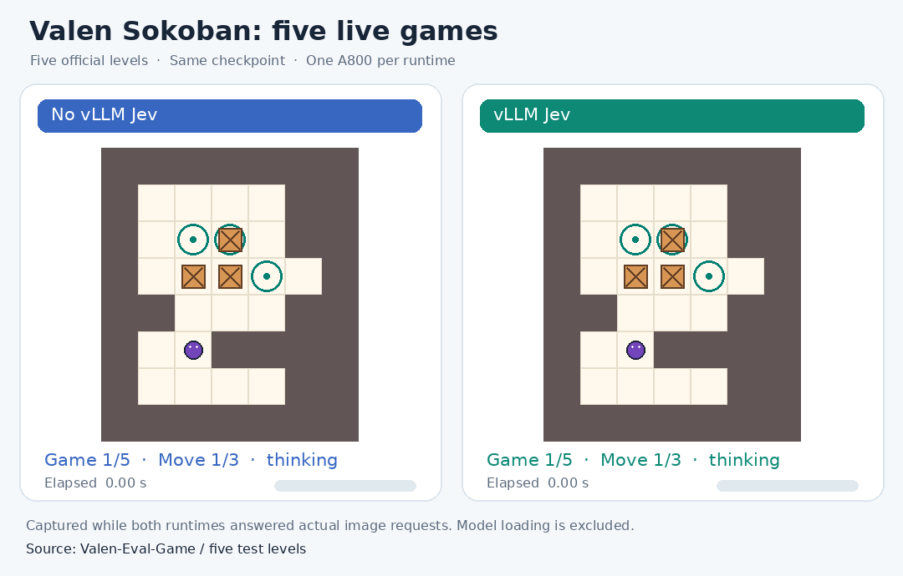
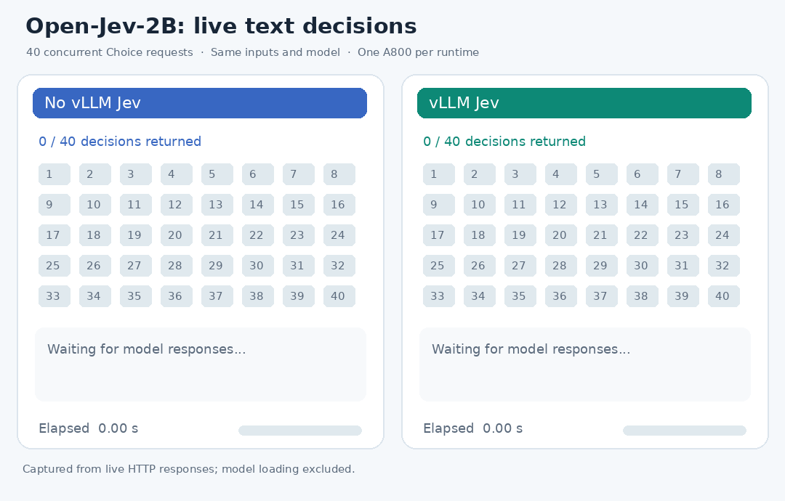

<h1 align="center">
  <picture>
    <source media="(prefers-color-scheme: dark)" srcset="docs/assets/vllm-jev-dark.svg">
    
  </picture>
</h1>

<h3 align="center">Candidate decisions and probabilities, served by vLLM</h3>

<p align="center">
  <a href="docs/guide.md"><b>Documentation</b></a> ·
  <a href="#demos"><b>Demos</b></a> ·
  <a href="#getting-started"><b>Getting Started</b></a> ·
  <a href="#example"><b>Example</b></a> ·
  <a href="#updates"><b>Updates</b></a>
</p>

---

## Demos

### Multimodal: live Sokoban



Both runtimes played the same five levels from [Valen's Sokoban evaluation set](https://huggingface.co/datasets/Valen-Team/Valen-Eval-Game) with the same checkpoint and one A800 each.

### Text: 40 concurrent decisions



The [Open-Jev-2B](https://huggingface.co/ZefanCai/Open-Jev-2B) author HTTP server and vLLM Jev received the same 40 text-only Choice requests at once, on one A800 each.

## About

vLLM Jev serves compatible Jev-style checkpoints through [vLLM](https://github.com/vllm-project/vllm). Give it a question and candidate answers; it returns a label and a probability for each candidate.

- **Native vLLM serving:** scheduling, batching, compilation, KV cache, and metrics.
- **Native decision readouts:** scalar candidate branches or marker-token scores, selected from the model format.
- **Structured decisions:** Choice, Noul (yes/no), and Score (ordered levels) over HTTP.
- **Multimodal inference:** Valen and vjev vision models accept text and images through the same System One API.
- **Automatic setup:** give the launcher a supported Hugging Face model ID; it selects and verifies the native protocol. Serving does not train.

## Getting Started

Install vLLM Jev with [`uv`](https://docs.astral.sh/uv/) from the repository directory:

```bash
uv pip install .
```

For development, use an [editable installation](docs/guide.md#installation).

Start a server with a supported Hugging Face model ID:

```bash
vllm-jev serve ZefanCai/Open-Jev-2B
```

The command downloads and prepares the model, then starts native vLLM at `http://127.0.0.1:8795`. Later runs reuse the prepared checkpoint.

<details>
<summary>GPU, port, and serving options</summary>

```bash
CUDA_VISIBLE_DEVICES=0 vllm-jev serve ZefanCai/Open-Jev-2B \
  --gpu-memory-utilization 0.90 --port 8795
```

Add standard `vllm serve` flags to override the defaults. See [serving options](docs/guide.md#serving-options) for storage locations and other flags.

</details>

Visit our [documentation](docs/guide.md) to learn more.

- [Installation](docs/guide.md#installation)
- [Quickstart](docs/guide.md#quickstart)
- [List of Supported Models](docs/guide.md#supported-models)

## Supported Models

Choose a model and run its command:

| Model | Start server |
|---|---|
| [ZefanCai/Open-Jev-2B](https://huggingface.co/ZefanCai/Open-Jev-2B) | `vllm-jev serve ZefanCai/Open-Jev-2B` |
| [ZefanCai/Open-Jev-9B](https://huggingface.co/ZefanCai/Open-Jev-9B) | `vllm-jev serve ZefanCai/Open-Jev-9B` |
| [IamBusy/OpenJev-0.6B](https://huggingface.co/IamBusy/OpenJev-0.6B) | `vllm-jev serve IamBusy/OpenJev-0.6B` |
| [lostargon/Tiny-Jev](https://huggingface.co/lostargon/Tiny-Jev) | `vllm-jev serve lostargon/Tiny-Jev` |
| [Valen-Team/Valen-Preview-0923](https://huggingface.co/Valen-Team/Valen-Preview-0923) | `vllm-jev serve Valen-Team/Valen-Preview-0923` |
| [yah01/vjev-vision](https://huggingface.co/yah01/vjev-vision) | `vllm-jev serve yah01/vjev-vision` |
| [yah01/vjev-vision-pilot](https://huggingface.co/yah01/vjev-vision-pilot) | `vllm-jev serve yah01/vjev-vision-pilot` |

## Example

With the server running, send a Choice request:

```bash
curl -sS http://127.0.0.1:8795/v1/systemone \
  -H 'Content-Type: application/json' \
  -d '{"state":"I was charged twice and want a refund.","questions":{"intent":{"type":"choice","instructions":"Choose the customer intent.","criteria":{"billing":"A payment or refund issue","technical":"A malfunction or setup issue","other":"Another request"}}}}'
```

The response contains `answers.intent.choice` and `answers.intent.probabilities` for the supplied labels.

See the [user guide](docs/guide.md) for supported models, serving options, and Choice, Noul, and Score examples. The plugin targets **vLLM 0.29.0** and **Python 3.12+**.

For image questions, start a [supported vision model](docs/guide.md#supported-models) and follow the [image request example](docs/guide.md#text-and-images). These adapters accept text and images; video input is not yet supported.

## Updates

### 2026-09-25

- Added multimodal decision inference with support for text and images.
- Added a fused Tiny-Jev head: **12.1% higher throughput** in the measured 16-option, 16-concurrent workload.
- On 500 Valen image questions, median latency fell from **231.9 to 77.3 ms** (**3.0×**) with **86.8% target-support accuracy** on both paths. [Results](#inference-performance).

## Inference performance

Each row uses the same model, input, and A800 GPU for both paths. Lower latency and higher throughput are better. Measurement methods are noted below.

Paired values: **Without vLLM Jev → With vLLM Jev**.

| Model | Input | Concurrency | Latency (ms) | P95 (ms) | Throughput (req/s) | Speedup | Throughput gain |
|---|---|---:|---:|---:|---:|---:|---:|
| [Open-Jev-2B](https://huggingface.co/ZefanCai/Open-Jev-2B) | Short | 1 | 546.6 → 73.0 | 557.6 → 74.3 | 1.83 → 13.66 | 7.5× | 7.5× |
| [Open-Jev-2B](https://huggingface.co/ZefanCai/Open-Jev-2B) | Short | 8 | 4360.5 → 100.5 | 4451.8 → 105.2 | 1.83 → 78.83 | 43.4× | 43.1× |
| [Open-Jev-2B](https://huggingface.co/ZefanCai/Open-Jev-2B) | Long | 1 | 582.3 → 81.9 | 588.1 → 83.8 | 1.72 → 12.20 | 7.1× | 7.1× |
| [Open-Jev-2B](https://huggingface.co/ZefanCai/Open-Jev-2B) | Long | 8 | 4674.5 → 248.9 | 4745.4 → 272.2 | 1.71 → 31.65 | 18.8× | 18.5× |
| [Open-Jev-9B](https://huggingface.co/ZefanCai/Open-Jev-9B) | Short | 1 | 674.9 → 79.2 | 678.3 → 81.1 | 1.48 → 12.58 | 8.5× | 8.5× |
| [Open-Jev-9B](https://huggingface.co/ZefanCai/Open-Jev-9B) | Short | 8 | 5337.6 → 205.2 | 5393.2 → 207.4 | 1.50 → 38.87 | 26.0× | 26.0× |
| [Open-Jev-9B](https://huggingface.co/ZefanCai/Open-Jev-9B) | Long | 1 | 716.9 → 149.7 | 728.1 → 152.5 | 1.39 → 6.67 | 4.8× | 4.8× |
| [Open-Jev-9B](https://huggingface.co/ZefanCai/Open-Jev-9B) | Long | 8 | 5726.5 → 1016.6 | 5749.3 → 1019.3 | 1.40 → 7.87 | 5.6× | 5.6× |
| [OpenJev-0.6B](https://huggingface.co/IamBusy/OpenJev-0.6B)¹ | Short | 1 | 74.6 → 16.4 | 76.5 → 17.0 | 13.35 → 63.03 | 4.5× | 4.7× |
| [OpenJev-0.6B](https://huggingface.co/IamBusy/OpenJev-0.6B)¹ | Short | 8 | 583.2 → 37.5 | 601.6 → 49.3 | 13.62 → 198.70 | 15.5× | 14.6× |
| [OpenJev-0.6B](https://huggingface.co/IamBusy/OpenJev-0.6B)¹ | Long | 1 | 74.2 → 23.8 | 75.5 → 24.2 | 13.46 → 42.55 | 3.1× | 3.2× |
| [OpenJev-0.6B](https://huggingface.co/IamBusy/OpenJev-0.6B)¹ | Long | 8 | 584.5 → 67.9 | 598.0 → 70.6 | 13.63 → 117.24 | 8.6× | 8.6× |
| [Tiny-Jev](https://huggingface.co/lostargon/Tiny-Jev)² | Short | 1 | 28.5 → 10.2 | 29.0 → 17.8 | 35.03 → 88.45 | 2.8× | 2.5× |
| [Tiny-Jev](https://huggingface.co/lostargon/Tiny-Jev)² | Short | 8 | 216.9 → 28.8 | 222.0 → 45.7 | 36.61 → 254.99 | 7.5× | 7.0× |
| [Tiny-Jev](https://huggingface.co/lostargon/Tiny-Jev)² | Long | 1 | 28.4 → 11.5 | 30.1 → 12.4 | 34.59 → 85.70 | 2.5× | 2.5× |
| [Tiny-Jev](https://huggingface.co/lostargon/Tiny-Jev)² | Long | 8 | 223.0 → 43.3 | 224.3 → 59.7 | 35.75 → 179.94 | 5.1× | 5.0× |
| [Valen-Preview-0923](https://huggingface.co/Valen-Team/Valen-Preview-0923)³ | Image | 1 | 231.9 → 77.3 | 240.2 → 82.0 | 4.30 → 12.90 | 3.0× | 3.0× |
| [vjev-vision](https://huggingface.co/yah01/vjev-vision)⁴ | Image | 1 | 239.8 → 84.1 | 265.7 → 88.5 | 4.13 → 11.94 | 2.8× | 2.9× |
| [vjev-vision-pilot](https://huggingface.co/yah01/vjev-vision-pilot)⁴ | Image | 1 | 231.4 → 84.2 | 242.1 → 88.4 | 4.28 → 11.92 | 2.7× | 2.8× |

<details>
<summary>Benchmark notes</summary>

- ¹ OpenJev-0.6B uses the author's CUDA scorer as its baseline.
- ² Tiny-Jev uses a serialized HTTP wrapper around the author's Python API; gains include batching.
- ³ Valen uses sequential offline inference on 500 image questions. Both paths reached 86.8% target-support accuracy; choices agreed on 98.8%. Probability values differed, with a largest per-question difference of 0.295. HTTP time is excluded. A separate 500-request HTTP run at concurrency 8 reached 40.6 req/s (193.4 ms median latency).
- ⁴ vjev uses the author's Python scorer versus vLLM Jev HTTP on 100 identical game images and the same A800. Only the vLLM side includes HTTP time. This measures serving speed, not game accuracy.

</details>

## Contributing

Report bugs and feature requests in [Issues](https://github.com/Egbertjing/vllm-jev/issues). Use [Discussions](https://github.com/Egbertjing/vllm-jev/discussions) for questions and ideas. Submit code changes as [pull requests](https://github.com/Egbertjing/vllm-jev/pulls); the maintainer reviews them before merging.

## License

Apache-2.0. The Choice prompt follows MIT-licensed [Open-Jev](https://github.com/Zefan-Cai/Open-Jev); see [third-party notices](THIRD_PARTY_NOTICES.md).
